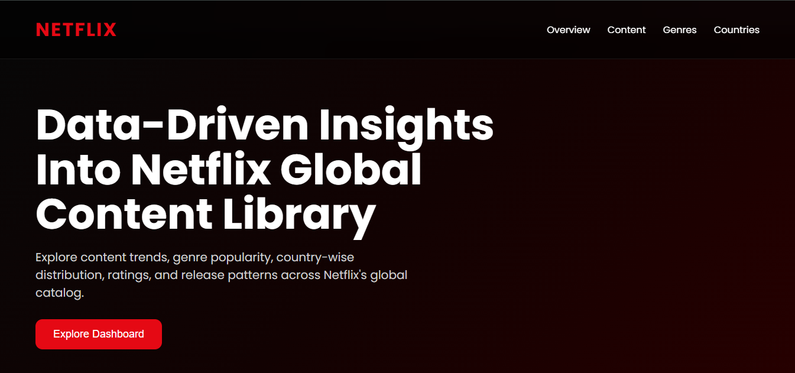
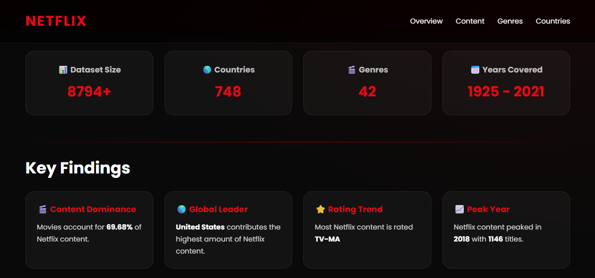
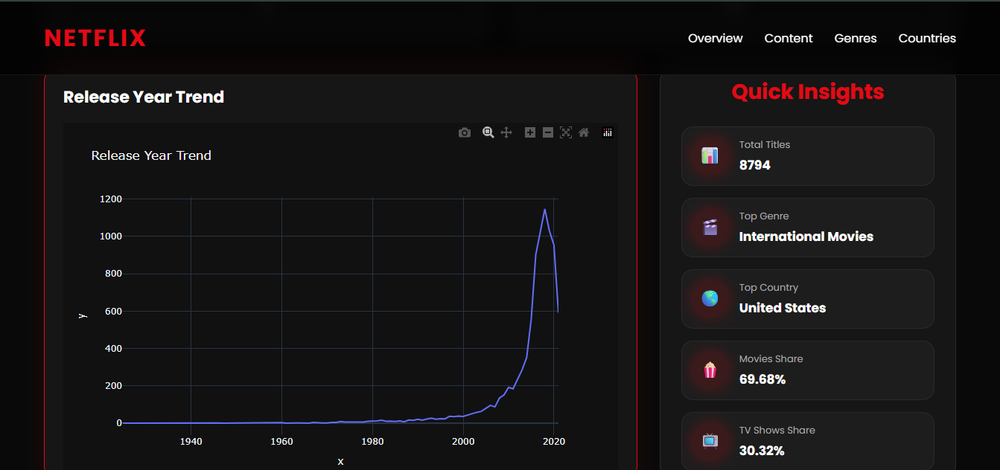

# 🎬 Netflix Analytics Dashboard

A premium data analytics dashboard built using Python, Flask, Pandas, and Plotly to explore and visualize trends from Netflix's global content library.

🌐 Live Demo:
https://netflix-analytics-dashboard-vp1v.onrender.com/

🔗 GitHub Repository:
https://github.com/harshtripathi560/Netflix-Analytics-Dashboard

---

## 📌 Project Overview

Netflix hosts thousands of movies and TV shows across multiple countries, genres, and audience categories.

This project performs Exploratory Data Analysis (EDA) on the Netflix dataset and transforms the findings into an interactive web dashboard with a modern Netflix-inspired user interface.

The dashboard enables users to explore:

- Content distribution (Movies vs TV Shows)
- Top genres available on Netflix
- Country-wise content production
- Content rating analysis
- Release year trends
- Key business insights and KPIs

---

## 🚀 Features

### Analytics Features

- Movies vs TV Shows Analysis
- Top 10 Genres Analysis
- Top 10 Countries Analysis
- Rating Distribution Analysis
- Release Year Trend Analysis
- Quick Insights Panel
- Business KPI Summary

### Dashboard Features

- Interactive Plotly Visualizations
- Netflix-Inspired Premium UI
- Responsive Layout
- Animated KPI Counters
- Scroll Reveal Animations
- Professional Dashboard Design
- Live Deployment on Render

---

## 🛠️ Tech Stack

### Frontend

- HTML5
- CSS3
- JavaScript

### Backend

- Python
- Flask

### Data Analysis

- Pandas
- NumPy

### Data Visualization

- Plotly

### Deployment

- Render

### Version Control

- Git
- GitHub

---

## 📊 Dataset Information

Source:
Netflix Movies and TV Shows Dataset (Kaggle)

Dataset Includes:

- 8,800+ Netflix Titles
- Movies and TV Shows
- Genre Information
- Country Information
- Content Ratings
- Release Years
- Content Descriptions

---

## 📈 Key Insights

### 🎬 Content Distribution

Movies dominate Netflix's catalog, accounting for approximately 70% of total content.

### 🌎 Top Content Producer

The United States contributes the largest share of Netflix content.

### ⭐ Most Common Rating

TV-MA is the most frequently occurring content rating.

### 📅 Content Growth

Netflix experienced significant content growth between 2017 and 2020.

---

## 📷 Dashboard Preview

### Home Section



### Analytics Dashboard


### Release Trend & Insights

---

## 📂 Project Structure

```text
Netflix-Analytics-Dashboard/
│
├── app.py
├── dashboard_data.py
├── requirements.txt
│
├── dataset/
│   ├── netflix_titles.csv
│   └── netflix_cleaned.csv
│
├── templates/
│   └── index.html
│
├── static/
│   └── css/
│       └── style.css
│
├── screenshots/
│
└── README.md
```

## ⚙️ Installation & Setup

Clone Repository

```bash
git clone https://github.com/harshtripathi560/Netflix-Analytics-Dashboard.git
```

Navigate to Project Directory

```bash
cd Netflix-Analytics-Dashboard
```

Install Dependencies

```bash
pip install -r requirements.txt
```

Run Flask Application

```bash
python app.py
```

Open Browser

```text
http://127.0.0.1:5000
```

---

## 🌐 Live Deployment

Application deployed using Render:

https://netflix-analytics-dashboard-vp1v.onrender.com/

---

## 🔮 Future Enhancements

- Advanced Filtering Options
- Search Functionality
- Recommendation Engine
- Machine Learning Insights
- User Authentication
- Downloadable Reports
- Advanced Business Analytics

---

## 👨‍💻 Author

Harsh Tripathi

Aspiring Data Analyst | Data Science Enthusiast | Python Developer

LinkedIn:
www.linkedin.com/in/harsh-tripathi-a819542a1

GitHub:
https://github.com/harshtripathi560

---

⭐ If you found this project useful, consider giving the repository a star.